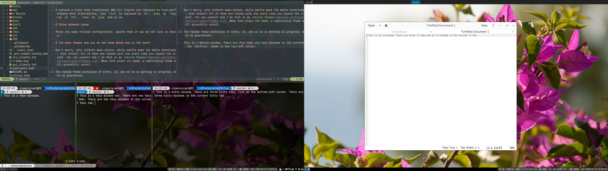

# How to manage dotfiles

This repository is now managed primarily through a Nix flake for NixOS and
Home Manager.

Apply the full NixOS host configuration:

```nu
sudo nixos-rebuild switch --flake .#nixos
```

Apply only the user Home Manager configuration:

```nu
home-manager switch --flake .#otakutyrant
```

Home Manager links the checked-in dotfile directories into `$HOME`. The helper
in `nixos/home.nix` recursively exposes files from directories such as `XDG`,
`i3`, `Kitty`, `Neovim`, `Nushell`, `Systemd`, and `Tmux`.

# Make dotfiles simple

Find a client which has highly refined default configuration so you do not override them too much (Neovim works well that it changes many vim default options). When overriding them, comment why you do that.

As for Neovim. If you can use third-part tool to handle files, use them rather than install an corresponding plugin, like useless Black plugin because you can execute external commands in Ex command as `:!black %`. Tinkering Neovim is ceaseless.

`.pre-commit-config.yaml`, `pyproject.toml`, `stylua.toml` assure the unified coding style of dotfiles.

# Introduction to unified, hierarchical windows management

Before the introduction, let us make sure what split means. Amazingly, "split window horizontally/vertically" is terribly ambiguous in [Linux](https://english.stackexchange.com/q/293520/355018). As an ESL learner, I decide to focus in the verb "split" itself. By instinct, if I split an object, I cut it through a horizontal line. But some other people may focus in the object itself. In other words, when the object is split "horizontally", it becomes two objects, distributed in horizontal direction. No wonder some Linux software will split objects horizontally in two different ways, because they focus in either verb or noun.

To be clear. In the dotfiles, "split window horizontally" means to cut it through a horizontal line. However sometimes it is necessary to distribute windows horizontally or vertically. I won't use "split" but "distribute". I think "distribute all windows horizontally" is unambiguous. Due to some Linux software have a contract meaning of "split horizontally" from their reserved keywords in configuration, or even use "split" and "distribute" interchangeably, I will clarify them by comments, especially in i3.

Now image you have multiple windows in your screen and you are a heavy Vim user. You have a master key, used to combine with any key to manage **tabs** and **windows**. Tabs are usually numbered, and a tab contains multiple windows. Windows can be split, distributed, moved between tabs, and killed.

When you want to jump the specific tab, just hit `master+num`.

When you want split a window vertically or horizontally, hit `master+v` or `master+s` respectively. If you want distribute all windows in the current tab instantly, hit `master+|` or `master+-`, the meaning of bar and hash symbols are enough obvious.

You would like to move focus between windows via `master+hjkl`.

When you want to kill a windows, hit `master+q`.

Now time to make the windows management hierarchical! In Linux, I use a windows manager, i3, to handles multiple GUI clients, including a virtual terminal, kitty. In turn, I use kitty to handles multiple CLI clients, including shells and an editor, Neovim. Eventually, I use Neovim to handles multiple files. The windows management of such three hierarchies are almost consistent, list as below:

|   Hierarchies    |  name  | What do they manage? | What do master keys call in them? | binded key |
| :--------------: | :----: | -------------------- | :-------------------------------: | :--------: |
| Windows Manager  |   i3   | GUI clients          |               $mod                |   super    |
| Virtual Terminal | kitty  | CLI clients          |                N/A                |    alt     |
|      Editor      | Neovim | Files                |            learder key            |   space    |
|   Multiplixer    |  tmux  | Remote sessions      |          the prefix key           |   ctrl-w   |

| name   | What do tabs call in them? | How to allocate a new tab? | How to jump to a tab? |
| ------ | -------------------------- | -------------------------- | --------------------- |
| i3     | workspace                  | N/A                        | super+num             |
| kitty  | tab                        | alt+n                      | alt+num               |
| Neovim | tabpage                    | space+n                    | space+num             |
| tmux   | window                     | ctrl-w+n                   | ctrl-w+num            |

| name   | What do windows call in them? | How to move focus between windows? | How to split a window horizontally or vertically? | How to distribute windows horizontally or vertically? | How to kill a window? |
| ------ | ----------------------------- | ---------------------------------- | ------------------------------------------------- | ----------------------------------------------------- | --------------------- |
| i3     | window                        | super+hjkl                         | super+s or super+v,                               | super+- or super+\|,                                  | super+q               |
| kitty  | window                        | alt+hjkl                           | alt+s or alt+v                                    | alt+- or alt+\|                                       | alt+q                 |
| Neovim | window                        | space+hjkl                         | space+s or space+v                                | N/A                                                   | space+q               |
| tmux   | pane                          | ctrl-w+hjkl                        | ctrl-w+s or ctrl-w+v                              | N/A                                                   | ctrl-w+q              |

Note:

1. kitty does not define master key, but you can use it anyway.
2. Creating tabs are unnecessary in i3, ten tabs are perpetually allocated to begin with.
3. In kitty, as far as I know, when you create a window, it always is a shell.
4. When you split in i3, no gap will be shown unless a new GUI client is launched. See https://github.com/i3/i3/discussions/5546
5. \- is a minus symbol and | bar symbol.
6. If you want to adjust the border between windows, use mouse. All hierarchies support it.
7. It seems that tmux can distribute windows too. But I have no interest to figure out how.
8. i3 and kitty can distribute windows layout to tabbed, stacked, and so on. Explorer it by yourself.
9. Although I said windows can be moved between tabs, I do not list related keymaps in the table.

Do you notice the relation between master keys? They are distributed in the left-bottom part of my Happy Hacking Keyboard exactly. How well organized they are.

Haplessly, kitty cannot handle remote sessions so far. So though I dislike tmux, it is still maintained as alternative to kitty in the dotfiles and listed in the table.



# XDG

I keep files in XDG locations when the application expects them there.

Configuration files should live under `$XDG_CONFIG_HOME` when possible. In this
repository, that usually means putting them under `XDG/.config`, which Home
Manager links into `~/.config`.

Default application choices belong in `mimeapps.list`.

Personal commands live in `$HOME/.local/bin`, although `XDG_BIN_HOME` is not
specified so far.

Desktop files are also XDG data files:

- `XDG/.local/share/applications/*.desktop` defines launcher entries for menus
  and `rofi -show drun`.
- `XDG/.config/autostart/*.desktop` defines applications started by `dex` during
  login.

Use static desktop files here when the command is stable, such as
`Exec=systemctl suspend`. If a desktop entry needs Nix interpolation, such as a
specific `${pkgs.foo}/bin/foo` path, define it with Home Manager instead.

Personal commands that should appear in rofi can be paired with a desktop file.
For example, `XDG/.local/bin/screenshot_delay` is exposed through
`XDG/.local/share/applications/screenshot-delay.desktop`.

# Environment Variables

Nushell environment variables live in `Nushell/.config/nushell/env.nu`.

# X11

I tried to migrate to Wayland but terminated, because Nvidia support is not good enough yet. Blame Nvidia!

# Packages

This repository targets NixOS with Home Manager. System options live in
`nixos/configuration.nix`, while user-facing development and GUI packages are
organized in `nixos/home-packages.nix`. Package names there are Nixpkgs
attribute names, not names from another distribution.

I noticed a trend that traditional GNU CLI clients are replaced by high-performance Rust alternatives, like `find` is replaced by `fd`, `grep` by `ripgrep` or `fzf`, `less` by `page` and so on.

# China network issue

There are some related configuration. Ignore them if you do not live in China.

# Too many themes and you do not know which one is the best?

Don't worry, only infants make choice, while adults want the whole enchilada! Just install all of them and random pick one every time you launch the client. You can consult how I do that in my [Neovim themes](Neovim/.config/nvim/lua/plugins/themes.lua). When fate plays its hand, a captivating theme will gracefully unfurl.

The random theme mechanism of kitty, i3, and so on is working in progress, but no guaranteed.

# Nushell

use `cargo install nu_plugin_gstat` and `plugin add gstat` to update the plugin when Nushell is upgraded.
