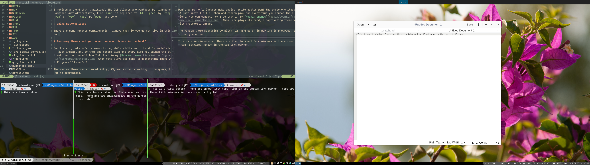

# How to manage dotfiles

This repository is now managed primarily through a Nix flake for NixOS and
Home Manager.

## Fresh NixOS system

Clone the repository with submodules:

```nu
git clone --recursive https://github.com/otakutyrant/dotfiles.git /etc/nixos/dotfiles
cd /etc/nixos/dotfiles
```

Build the bundled host configuration:

```nu
sudo nixos-rebuild switch --flake .#nixos
passwd otakutyrant
```

The NixOS configuration creates the `otakutyrant` user, enables flakes,
NetworkManager, Docker, PipeWire, fcitx5, NVIDIA graphics, greetd, and Sway.

## Home Manager only

If the system user already exists and Home Manager is installed:

```nu
home-manager switch --flake .#otakutyrant
```

Home Manager links the checked-in dotfile directories into `$HOME`. The helper
in `nixos/home.nix` recursively exposes files from directories such as `XDG`,
`Sway`, `Kitty`, `Neovim`, `Nushell`, and `Systemd`.

System options live in `nixos/configuration.nix`. User packages live in
`nixos/home-packages.nix`, with local package derivations under `nixos/pkgs`.

# Make dotfiles simple

Find a client which has highly refined default configuration so you do not override them too much (Neovim works well that it changes many vim default options). When overriding them, comment why you do that.

As for Neovim. If you can use third-part tool to handle files, use them rather than install an corresponding plugin, like useless Black plugin because you can execute external commands in Ex command as `:!black %`. Tinkering Neovim is ceaseless.

`nix fmt` formats Nix and Lua files through the formatter declared in
`flake.nix`. `nix run .#check` runs the same format checks plus Nix evaluation,
Lua diagnostics, and Nushell source/parser checks. Nushell is checked but not
formatted because `nufmt` has corrupted valid scripts in this repository.
`.pre-commit-config.yaml` wires these commands into pre-commit.

# Introduction to unified, hierarchical windows management

Before the introduction, let us make sure what split means. Amazingly, "split window horizontally/vertically" is terribly ambiguous in [Linux](https://english.stackexchange.com/q/293520/355018). As an ESL learner, I decide to focus in the verb "split" itself. By instinct, if I split an object, I cut it through a horizontal line. But some other people may focus in the object itself. In other words, when the object is split "horizontally", it becomes two objects, distributed in horizontal direction. No wonder some Linux software will split objects horizontally in two different ways, because they focus in either verb or noun.

To be clear. In the dotfiles, "split window horizontally" means to cut it through a horizontal line. However sometimes it is necessary to distribute windows horizontally or vertically. I won't use "split" but "distribute". I think "distribute all windows horizontally" is unambiguous. Due to some Linux software have a contract meaning of "split horizontally" from their reserved keywords in configuration, or even use "split" and "distribute" interchangeably, I will clarify them by comments, especially in Sway.

Now image you have multiple windows in your screen and you are a heavy Vim user. You have a master key, used to combine with any key to manage **tabs** and **windows**. Tabs are usually numbered, and a tab contains multiple windows. Windows can be split, distributed, moved between tabs, and killed.

When you want to jump the specific tab, just hit `master+num`.

When you want split a window vertically or horizontally, hit `master+v` or `master+s` respectively. If you want distribute all windows in the current tab instantly, hit `master+|` or `master+-`, the meaning of bar and hash symbols are enough obvious.

You would like to move focus between windows via `master+hjkl`.

When you want to kill a windows, hit `master+q`.

Now time to make the windows management hierarchical! In Linux, I use Sway to manage multiple GUI clients, including the Kitty terminal. Kitty manages multiple CLI clients, including shells and Neovim. Neovim then manages multiple files.

|   Hierarchies    |  name  | What do they manage? | What do master keys call in them? | binded key |
| :--------------: | :----: | -------------------- | :-------------------------------: | :--------: |
| Windows Manager  |  Sway  | GUI clients          |               $mod                |   super    |
| Virtual Terminal | kitty  | CLI clients          |                N/A                |    alt     |
|      Editor      | Neovim | Files                |            learder key            |   space    |

| name   | What do tabs call in them? | How to allocate a new tab? | How to jump to a tab? |
| ------ | -------------------------- | -------------------------- | --------------------- |
| Sway   | workspace                  | N/A                        | super+num             |
| kitty  | tab                        | alt+n                      | alt+num               |
| Neovim | tabpage                    | space+n                    | space+num             |

| name   | What do windows call in them? | How to move focus between windows? | How to split a window horizontally or vertically? | How to distribute windows horizontally or vertically? | How to kill a window? |
| ------ | ----------------------------- | ---------------------------------- | ------------------------------------------------- | ----------------------------------------------------- | --------------------- |
| Sway   | window                        | super+hjkl                         | super+s or super+v                                | super+- or super+\|                                  | super+q               |
| kitty  | window                        | alt+hjkl                           | alt+s or alt+v                                    | alt+- or alt+\|                                       | alt+q                 |
| Neovim | window                        | space+hjkl                         | space+s or space+v                                | N/A                                                   | space+q               |

Note:

1. kitty does not define master key, but you can use it anyway.
2. The Sway configuration declares ten named workspaces.
3. In kitty, as far as I know, when you create a window, it always is a shell.
4. In Sway, `super+s` and `super+v` split the focused container using the original i3 behavior.
5. \- is a minus symbol and | bar symbol.
6. If you want to adjust the border between windows, use mouse. All hierarchies support it.
7. `super+t` arranges the workspace in a tabbed layout.
8. Although I said windows can be moved between tabs, I do not list related keymaps in the table.

Do you notice the relation between master keys? They are distributed in the left-bottom part of my Happy Hacking Keyboard exactly. How well organized they are.



# XDG

I keep files in XDG locations when the application expects them there.

Configuration files should live under `$XDG_CONFIG_HOME` when possible. In this
repository, that usually means putting them under `XDG/.config`, which Home
Manager links into `~/.config`.

Default application choices belong in `mimeapps.list`.

Personal commands live in `$HOME/.local/bin`, although `XDG_BIN_HOME` is not
specified so far.

Desktop files are also XDG data files:

- `XDG/.local/share/applications/*.desktop` defines launcher entries for menus
  and `rofi -show drun`.

Applications started at login are configured directly in the startup section of
`Sway/.config/sway/config`.

Use static desktop files here when the command is stable, such as
`Exec=systemctl suspend`. If a desktop entry needs Nix interpolation, such as a
specific `${pkgs.foo}/bin/foo` path, define it with Home Manager instead.

Personal commands that should appear in rofi can be paired with a desktop file.
For example, `XDG/.local/bin/screenshot_delay.nu` is exposed through
`XDG/.local/share/applications/screenshot-delay.desktop`.

# Environment Variables

Session environment variables are managed in `nixos/home.nix`.

# Wayland and NVIDIA

Sway reads the plain-text config at `Sway/.config/sway/config`. It preserves
the original workspaces, shortcuts, layout rules, and scratchpad. Ironbar
provides workspace and system-information modules, with a Nushell script for
NVIDIA GPU utilization and memory. The screenshot and idle tools use Wayshot,
wl-clipboard-rs, Swaylock, and Swayidle. The screenshot selector saves captures
under `~/Pictures/Screenshots` and copies them to the clipboard.

The output rules in the config retain the former three-monitor layout. Check
connector names and available modes with `swaymsg -t get_outputs`; DRM names can
differ from the old XRandR names. Sway's `output` commands can be tested live
before editing the persistent rules.

Current wlroots and Sway support NVIDIA's explicit synchronization, so the old
community source patches are no longer needed. The setup follows the
nixpkgs-wayland community guidance: enable DRM modesetting, use
`WLR_NO_HARDWARE_CURSORS=1`, and pass `--unsupported-gpu` to Sway. That option
suppresses Sway's startup notice; it does not change its official support
policy. The NVIDIA application profile also limits retained compositor buffers.

The session keeps the other Wayland tools: Waytrogen with awww, Wired, Clipcat,
wdotool, wkeys, and nwg-displays. rqbit replaces Fragments and qBittorrent.
It cannot import Fragments/Transmission's saved session or piece-progress map.
To carry downloaded progress over, start rqbit's server, then add each same
torrent through its Web UI/API with `overwrite=true` and the existing download
directory as `output_folder`. rqbit can resume from files already on disk and
will verify their pieces. Keep the torrent's filenames and directory layout
unchanged. Tracker state, ratios, and peer/session details do not transfer.
Xwayland remains available for existing X11 clients.

# Packages

This repository targets NixOS with Home Manager. System options live in
`nixos/configuration.nix`, while user-facing development and GUI packages are
organized in `nixos/home-packages.nix`. Package names there are Nixpkgs
attribute names, not names from another distribution.

I noticed a trend that traditional GNU CLI clients are replaced by high-performance Rust alternatives, like `find` is replaced by `fd`, `grep` by `ripgrep` or `fzf`, `less` by `page` and so on.

# China network issue

There are some related configuration. Ignore them if you do not live in China.

# Too many themes and you do not know which one is the best?

Don't worry, only infants make choice, while adults want the whole enchilada! Just install all of them and random pick one every time you launch the client. You can consult how I do that in my [Neovim themes](Neovim/.config/nvim/lua/plugins/themes.lua). When fate plays its hand, a captivating theme will gracefully unfurl.

The random theme mechanism of Kitty, Sway, and related applications is still a work in progress.
